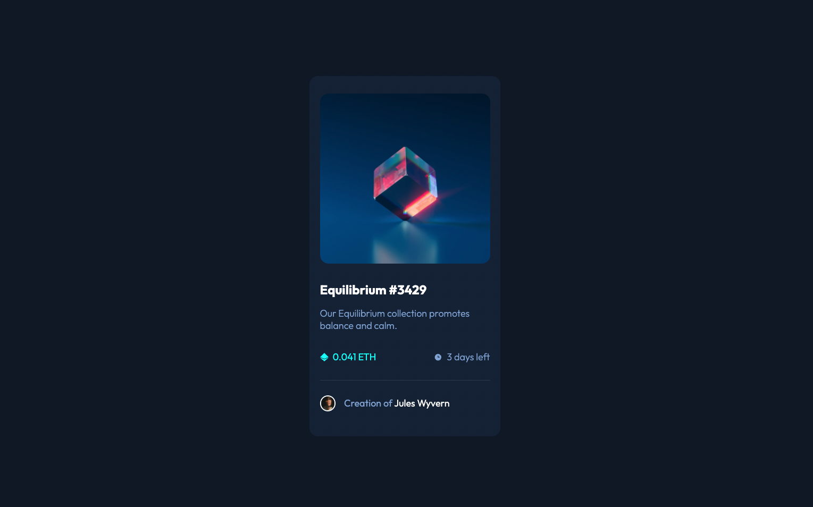

# Frontend Mentor - NFT preview card component solution

This is a solution to the [NFT preview card component challenge on Frontend Mentor](https://www.frontendmentor.io/challenges/nft-preview-card-component-SbdUL_w0U). Frontend Mentor challenges help you improve your coding skills by building realistic projects. 

## Table of contents

- [Overview](#overview)
  - [The challenge](#the-challenge)
  - [Screenshot](#screenshot)
- [My process](#my-process)
  - [Built with](#built-with)
  - [What I learned](#what-i-learned)
- [Author](#author)

### The challenge

Users should be able to:

- View the optimal layout depending on their device's screen size
- See hover states for interactive elements

### Screenshot



### Links

- Live Site URL: [Add live site URL here](https://radanovicnikola93.github.io/nft-preview-card/)

### Built with

- Semantic HTML5 markup
- SCSS (SASS)
- Flexbox

### What I learned

Got a better understanding on ::before and ::after selectors

```css
&:hover::before {
    content: "";
    background: hsl(178, 100%, 50%);
    opacity: 50%;
    position: absolute;
    left: 0;
    height: 99%;
    width: 100%;
    border-radius: 1rem;
  }

  &:hover::after {
    content: url(../../../images/icon-view.svg);
    position: absolute;
    left: 50%;
    top: 50%;    
    transform: translate(-50%, -50%);
  }
```
## Author

- Website - [Nikola Radanovic](https://www.nikola-radanovic.com)
- Frontend Mentor - [@radanovicnikola93](https://www.frontendmentor.io/profile/radanovicnikola93)